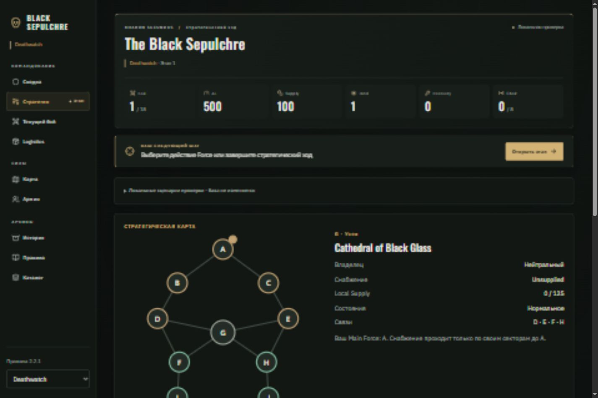
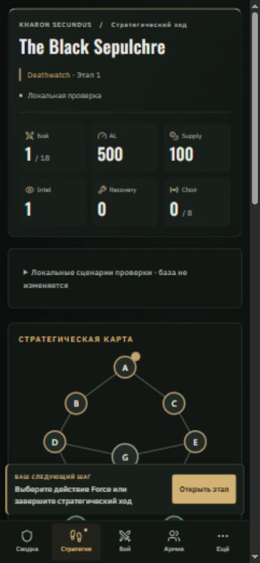

# Black Sepulchre — приоритеты UI/UX и первая фаза

Дата: 05.10.2026. Основа анализа — приложенный `Black_Sepulchre_UI_UX_Luxury_Polish_2026-10-05_RU.md`, опубликованный экран входа и текущий локальный код приложения 2.2.1.

Обзор содержит предложения. Для первой фазы выбрана часть с наиболее широким эффектом: общий командный интерфейс, который используется во всех разделах. Рабочая папка не содержит истории коммитов приложения, поэтому соответствие упомянутому в обзоре `main @ 941a018` не подтверждено.

## Самые полезные и заметные улучшения

| Приоритет | Улучшение                                         | Практический результат                                                                              | Способ реализации                                                                                                                  | Объём                                       |
| --------- | ------------------------------------------------- | --------------------------------------------------------------------------------------------------- | ---------------------------------------------------------------------------------------------------------------------------------- | ------------------------------------------- |
| 1         | Command HUD + закреплённый следующий шаг          | На любом экране видны этап, ресурсы и действие игрока; ожидание соперника читается отдельно         | Общие React-компоненты поверх существующих `State`, `nextStep` и `syncMessage`                                                     | Небольшой / средний — выполнена первая фаза |
| 2         | Карта как инструмент стратегии                    | Выбор сектора на карте сразу готовит движение; стоимость и причина недоступности видны до отправки  | Управляемые `selected` / `onSelect` у `CampaignMap`, общий target со `StrategyView`, предварительная проверка существующим движком | Средний                                     |
| 3         | Logistics: список проблем и сводка операций       | Игрок видит, какие отряды требуют внимания, сколько доступно денег и что уже сделано в текущем окне | Производный список из своего доступного состояния; расчёты из `logisticsPreview`; операции через существующий `send`               | Средний / большой                           |
| 4         | Боевой экран с постоянными счётом и текущим шагом | Меньше прокрутки во время партии; миссия, раунд и следующий шаг читаются вместе                     | Представление поверх существующего `battle.table`; закреплённый счёт, desktop split layout, мобильные секции                       | Большой                                     |
| 5         | Карточки армии / Muster и полосы лимитов          | Проще выбрать состав и найти повреждённый или недоступный отряд                                     | Общая компактная карточка, локальные фильтры, бюджеты и причины ошибок из `validateMuster`; сохранение существующих черновиков     | Средний / большой                           |

Следом по ценности — подтверждения с конкретными последствиями, инспекторы правил/отрядов и человеческая летопись кампании. Command palette, уведомления и декоративная анимация полезны после стабилизации главных сценариев.

## Внедрено в первой фазе

- **Единый Command HUD.** Название кампании, текущая фаза, фракция и этап собраны с ресурсами в одном блоке. Бой, AL, Supply, Intel, Recovery и Choir имеют иконку и крупное число; аварийный долг показывается при наличии.
- **Изменения ресурсов.** При изменении чисел отображается дельта на три секунды и подсветка карточки. Переключение стороны или кампании устанавливает новую исходную точку. Дельта описывает разницу между полученными состояниями, а не приписывает ей неподтверждённую причину.
- **Пояснения к ресурсам.** Доступны при наведении и клавиатурном фокусе; подписи присутствуют в доступном имени элемента.
- **Закреплённое следующее действие.** На desktop — панель над рабочим разделом, закрепляемая при прокрутке; на телефоне — над нижней навигацией. Свой шаг имеет золотую кнопку, ожидание — спокойное вторичное оформление.
- **Навигация по трём группам.** Командование, Силы, Архивы. У действующего этапа есть отдельный маркер, который сохраняется при чтении другого раздела. Выбранный раздел использует `aria-current`.
- **Мобильная навигация.** Сводка, Стратегия, Бой, Армия, Ещё. Остальные разделы, выбор кампании и выход доступны в модальном меню. Native dialog ограничивает фокус, закрывается по Escape и возвращает фокус к кнопке открытия.
- **Компактная связь.** Основное сообщение остаётся в шапке; участие второго игрока, пояснение статуса и версия состояния доступны в раскрывающихся подробностях. Время последней проверки не объявляется каждую секунду через `aria-live`.
- **Обратная связь при копировании приглашения.** Успех и необходимость ручного копирования отображаются рядом с кодом.
- **Визуальная основа.** Тёмные поверхности разной глубины, старое золото для команд, небольшие фракционные акценты, токены цветов/отступов/радиусов/движения, заметный фокус и режим reduced motion. Сохранена пара IBM Plex Sans / Oswald.
- **Единая локальная проверка.** `Demo` использует те же `CampaignShell` и `CommandHUD`, что основной `App`. Это позволяет проверять общий интерфейс на тестовых сценариях.

Панель следующего шага расположена вне блокируемого игрового fieldset: переход к нужному экрану остаётся доступным, когда проверяется прежняя отправка. Поиск элемента для прокрутки учитывает отложенную загрузку разделов.

Основные файлы:

- `src/views/CampaignShell.tsx` — общий каркас и навигация;
- `src/views/CommandHUD.tsx` — шапка и ресурсы;
- `src/views/NextStep.tsx` — панель следующего действия;
- `src/views/SyncStatus.tsx` — компактный режим связи;
- `src/styles.css` — токены и responsive-оформление;
- `src/App.tsx`, `src/Demo.tsx` — подключение общего интерфейса.

## Проверка

- `npm test`: **118 / 118** существующих тестов прошли, включая синхронизацию, порядок ходов, экономику, приватность составов и локальные SQL-проверки.
- `npm run build`: успешны компиляция правил, TypeScript, Vite и копирование PDF. Сборка сообщает о крупном отдельном `DatasheetView` chunk; переразбиение каталога не входит в эту фазу.
- Prettier: изменённые файлы проверены.
- Браузер: локальная `?demo`-кампания, ширины **320, 390, 820, 1440 px**. Горизонтального переполнения общего интерфейса не обнаружено.
- Проверены переход из мобильного меню к правилам и возврат через «Открыть этап», действие Recon и дельта Intel `+1`, смена фракции без ложной дельты, оформление ожидания, Escape и возврат фокуса, закрепление панели действий. Дополнительно проверены маркер текущего этапа в Logistics и переход к `muster-panel` с прокруткой ниже закреплённой панели. В локальных сценариях ошибок браузера не зарегистрировано.

Полный браузерный тест двух настоящих Auth-сессий с локальным Supabase в этой фазе не запускался. Визуальные сценарии проверены в Demo; доступ к рабочей кампании через авторизацию не использовался. Изменения подготовлены локально, публикация на GitHub Pages не выполнена.

## Следующая фаза: Strategy + Map

Продолжение внедрено: [результаты второй фазы и проверки](UI_UX_POLISH_PHASE_2_2026-10-05_RU.md).

1. Передать выбор сектора из `StrategyView` в карту; сохранить select как альтернативный ввод.
2. Показывать доступные маршруты и стоимость выбранного действия по существующим предварительным проверкам. Разделить легальность, hostile/friendly состояние и недостаток ресурсов.
3. Добавить видимые состояния узлов и сил; не полагаться только на цвет владельца.
4. Перестроить desktop в карту и панель действий, mobile — в последовательность карта → выбранная цель → действие.
5. Проверить normal move, Occupation, Deep Raid, закрытое окно реакции, недостаток Intel/MP и управление клавиатурой.

После неё — Army/Logistics, затем Battle/Muster/Result. Это сохраняет небольшие проверяемые изменения и позволяет использовать общий интерфейс первой фазы во всех следующих экранах.

## Скриншоты

Desktop:

Телефон:

