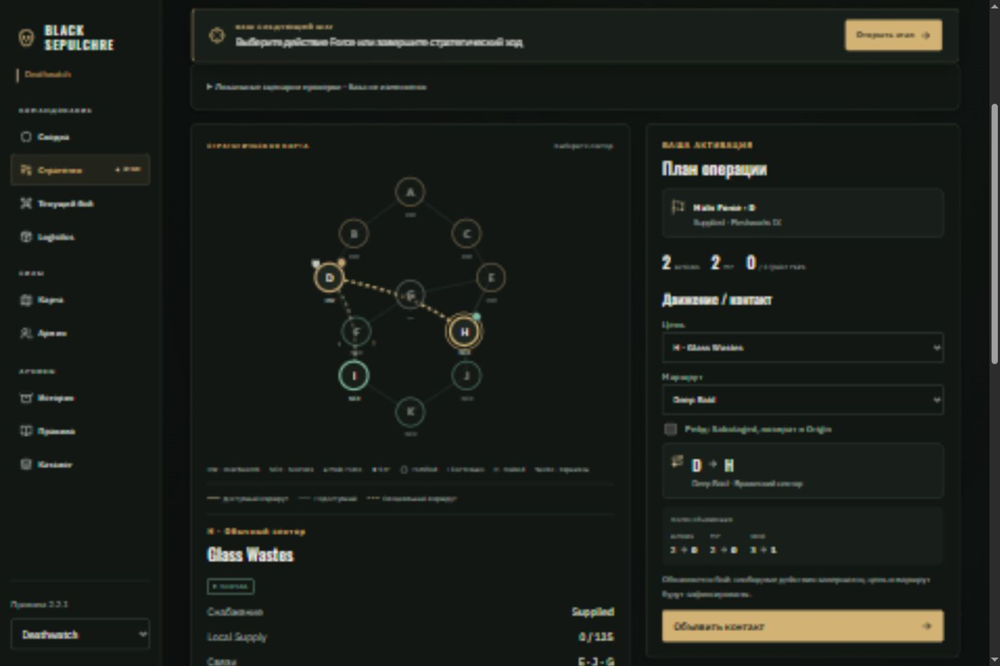
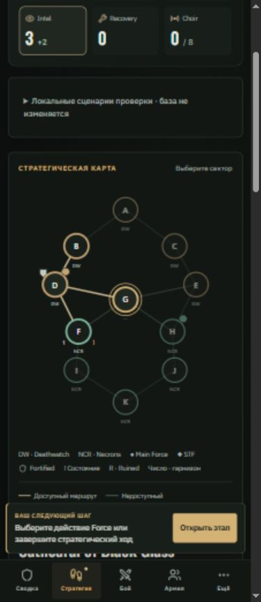
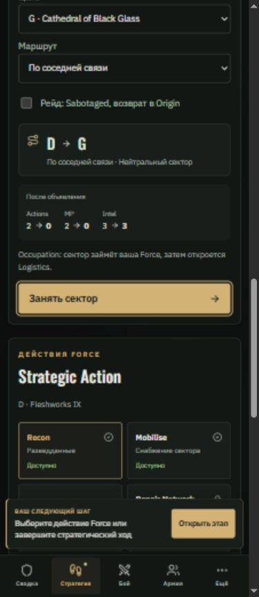

# Black Sepulchre — вторая фаза: Strategy + Map

Дата: 05.10.2026. Продолжение [первой фазы](UI_UX_POLISH_PHASE_1_2026-10-05_RU.md), выбранное по приложенному обзору UI/UX.

Карта стала частью подготовки приказа: выбор сектора, проверка маршрута и отправка действия используют одну цель. На компьютере карта и план операции расположены рядом; на телефоне идут последовательно.

## Внедрено

- **Общая цель.** Нажатие сектора на карте заполняет поле «Цель». Выбор в поле выделяет тот же сектор на карте. Сам выбор не отправляет команду и не тратит ресурсы.
- **Доступные маршруты.** Подсвечиваются разрешённые направления для выбранного способа входа. Специальные маршруты показаны пунктиром; текущая Force и выбранная цель различаются. Недоступный сектор можно осмотреть и увидеть причину запрета.
- **Проверка перед отправкой.** Рядом с приказом показаны ресурсы «до → после» и последующий результат: обычное движение, Occupation, объявление боя или осада Home. Нелегальную команду нельзя отправить из этой формы.
- **Фактические правила.** Предварительная проверка использует существующий `command` с клонированием состояния. Учитываются Supplied Origin, расстояние, Intel, скидка G, одноразовые маршруты, ограничения MP/Actions и действующее окно. Серверная проверка команды сохраняет окончательную роль.
- **Состояния карты.** Видны подписи DW/NCR, Main Force и STF, Fortified, Ruined, предупреждение о других состояниях и количество отрядов гарнизона. Инспектор показывает снабжение, Local Supply, связи, состояния и силы выбранного сектора. Состав гарнизона раскрывается по запросу.
- **Карточки действий.** Все одиннадцать Strategic Actions видны одновременно с доступностью или сообщением движка. Выбор карточки открывает параметры действия и прогноз ресурсов. Сохранились выпадающий список действий, настройка Stage Package и назначения отряда.
- **Отдельный Sabotage.** Цель берётся с карты. Обычная и автоматическая версии имеют отдельные прогнозы; перед отправкой объясняется окно Counter-Sabotage. В окне реакции атакующий ждёт, защищающийся может ответить или пропустить; при недостатке Intel Counter заблокирован.
- **Иерархия приказов.** Основное движение имеет заметную кнопку. Завершение стратегии вынесено в отдельную спокойную панель с напоминанием о потере неиспользованных Actions/MP.
- **Клавиатура и телефон.** Каждый сектор доступен через Tab, Enter и Space; Space не прокручивает страницу. SVG-карта больше не скрывает интерактивные сектора за ролью изображения. Прозрачная зона нажатия сектора на ширине 320 px — около 47 × 47 px.

Предварительная проверка не возвращает будущую миссию, боевое состояние или журнал бросков. Для Missing Hour проверяется успешная ветка, а интерфейс явно отмечает неопределённость. Случайные положительные награды не показываются как гарантированный доход.

Расчёты сохранены через `useMemo`. При изменении цели пересчитываются только версии Sabotage; остальные действия Force от цели не зависят. На локальном состоянии размером около 762 КБ полный набор предварительных проверок занимал в среднем 172 мс; это измерение Node, не браузерная метрика задержки.

## Основные файлы

- `src/views/StrategyView.tsx` — отдельный раздел стратегии, общая цель, карточки и прогнозы;
- `src/views/CampaignMap.tsx` — управляемый выбор, маршруты, маркеры и инспектор;
- `shared/strategy-preview.ts` — проверка по движку без изменения исходного состояния;
- `src/styles.css` — desktop/mobile компоновка и оформление состояний;
- `src/App.tsx`, `src/Demo.tsx` — подключение раздела и локальные сценарии;
- `tests/strategy-preview.test.ts` — пять дополнительных тестов предварительных проверок.

## Проверка

- **123 / 123 теста прошли.** Новые тесты проверяют неизменность исходного состояния, соответствие фактическому расходу ресурсов, скидку G, запрет пустого рейда, неснабжаемый Origin, чужую активацию, закрытое окно реакции, Airlift, Door Route и Missing Hour. Проверяется отсутствие полей будущей миссии/боя/бросков в возвращаемом прогнозе.
- **Production build прошёл.** Проверены TypeScript, сборка Vite и подготовка ресурсов. Остаётся предупреждение о большом отдельном chunk `muster` (~721 КБ); переразбиение подготовки армии не относится к этой фазе.
- **Prettier:** изменённые файлы проверены.
- **Браузер:** ширины 320, 390, 820 и 1440 px; горизонтального переполнения нет.
- Проверены выбор цели в обе стороны, Space без прокрутки и обычные перемещения A → B → D: MP 2 → 1 → 0, Actions сохраняются. После исчерпания MP кнопка движения заблокирована.
- Проверены Deep Raid D → H: Intel 3 → 1, Actions/MP → 0, открывается выбор миссии; запрещённый пустой рейд в G; Occupation D → G с переходом в Logistics и отображением новой Force в секторе.
- Проверены Fortify: Supply 100 → 25 и повторная недоступность; обычный/автоматический Sabotage: Intel 3 → 2 / 1; ожидание атакующего, Counter защищающегося, блокировка дальнейшего Deep Raid при нехватке Intel и ожидание чужой активации.
- В проверенных локальных сценариях ошибок и предупреждений браузера не зарегистрировано.

Проверка проводилась в DEV `?demo`, без авторизации и изменений рабочей кампании. Полный E2E двух Auth-сессий с локальным Supabase не запускался. Изменения подготовлены локально; публикация на GitHub Pages не выполнялась.

Для самостоятельной проверки раскройте «Локальные сценарии проверки»: `strategy` возвращает стартовую стратегию, `routes` размещает Main Force в D, даёт 3 Intel и добавляет силы/состояния на карте. Эти сценарии исключены из production.

## Следующая фаза

Army / Logistics внедрена: [результат третьей фазы и стилевой план](UI_UX_POLISH_PHASE_3_2026-10-05_RU.md).

Army / Logistics: список отрядов, требующих внимания, фильтры по состоянию и местоположению, заметные бюджеты и последствия выбранной операции. Затем Battle / Muster / Result, где пригодятся общая карточка отряда и постоянная сводка текущего шага.

## Скриншоты

Компьютер — маршрут и приказ:

Телефон — карта:

Телефон — последствия приказа:

