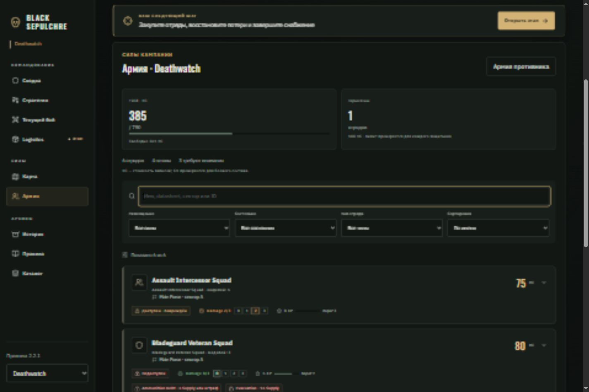
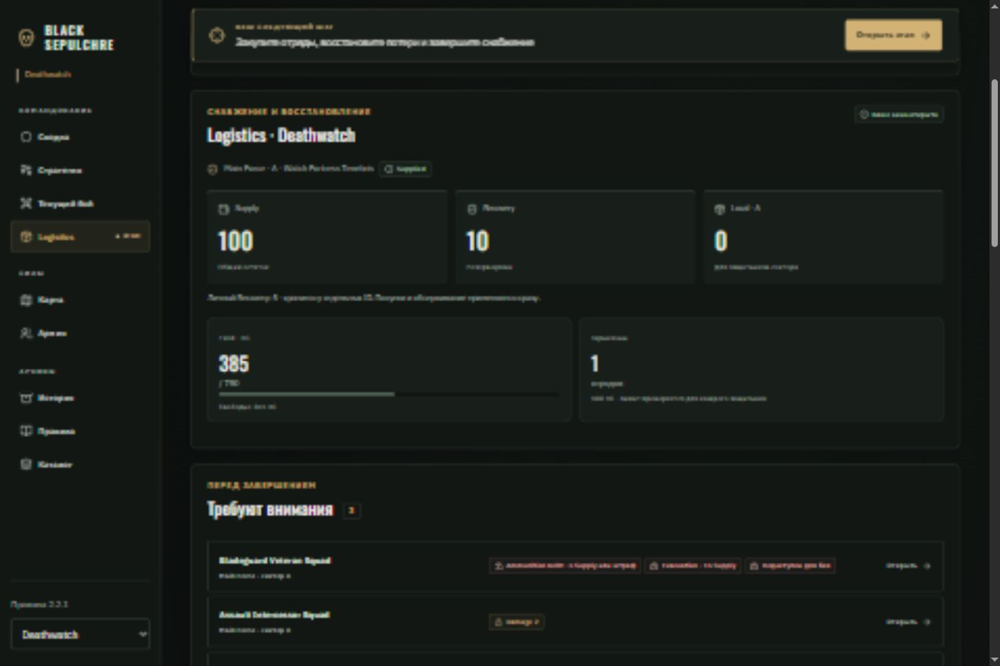
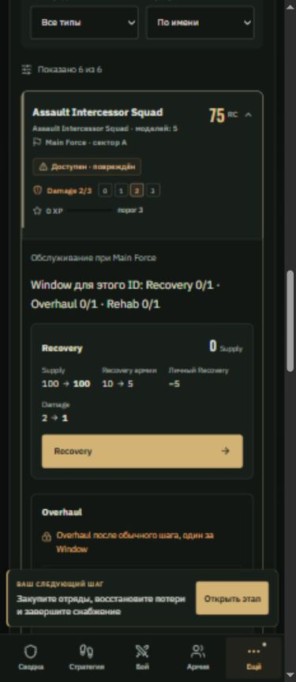

# Black Sepulchre — третья фаза: Army / Logistics и стиль

Дата: 05.10.2026. Продолжение [Strategy + Map](UI_UX_POLISH_PHASE_2_2026-10-05_RU.md) по предложениям приложенного обзора.

## Когда внедрять стиль

Направление обзора — сдержанная готическая командная консоль — подходит уже существующей паре IBM Plex Sans / Oswald и характеру кампании. Его стоит внедрять одновременно с переработкой рабочих экранов: так карточки, статусы, бюджеты и команды сразу получают общую систему.

| Этап                     | Что доводить                                                                                                                           |
| ------------------------ | -------------------------------------------------------------------------------------------------------------------------------------- |
| Уже сделано в фазах 1–2  | Общие поверхности, палитра, HUD, ресурсные карточки, навигация, action dock, фокус и reduced motion                                    |
| Текущая фаза             | Карточки отрядов, небольшие фракционные акценты, единые статусы, Damage/XP, уровни карточек и блоков, бюджеты снабжения                |
| Battle / Muster / Result | Постоянная сводка боя, бюджет состава, карточки миссий и последствия результатов в той же системе                                      |
| После основных экранов   | Общий визуальный проход: плотность, типографика, отступы, иконки, состояния hover/focus/loading, проверка согласованности всех экранов |

Отдельную декоративную тему поверх старых форм сейчас делать не нужно. В этой фазе стиль уже развивается в самих компонентах: матовые поверхности, тонкие металлические линии, спокойные оттенки статусов, крупные рабочие числа. Золото выделяет основные команды; фракция обозначается небольшими акцентами карточки. Фон получил едва заметные процедурные линии; внешних растровых фонов нет.

## Внедрено

### Army

- Браузер армии с поиском по имени, datasheet, сектору и ID.
- Совместимые фильтры: Main Force / STF / гарнизон; готовые / повреждённые / недоступные / требующие внимания; Character / Battleline / другие.
- Сортировка по имени, RC, XP или Damage. Видны число результатов и сброс условий; для пустого результата есть понятное сообщение.
- Компактная карточка: имя и профиль, число моделей, размещение, сектор, RC, доступность, четыре уровня Damage, XP и следующий порог опыта. Порог XP не обещает автоматически применённый Honour.
- Honours, Scars, Commission и отложенные решения читаются до раскрытия карточки. Datasheet, подробные эффекты и UUID находятся в раскрывающихся разделах.
- Тяжёлая часть карточки и обслуживание монтируются только после раскрытия. Поиск и сортировка используют производные данные без изменения кампании.
- Полосы Field / STF соответствуют различным правилам подсчёта: Field учитывает незакрытые displaced ID; STF — активные ID. Гарнизоны показаны отдельно, без выдуманного общего лимита.
- Переключение на армию соперника сохраняет просмотр без собственных операций обслуживания.

### Logistics

- Сверху — Supply, Recovery армии, Local текущей Force и долг при наличии. Личный Recovery показан отдельно: эти средства принадлежат конкретным ID.
- Список внимания собирает Damage, Evacuation, Ammunition Debt, pending Honour, Commission, retired datasheet и недоступность. Обязательный долг по боеприпасам ставится первым.
- Нажатие проблемного отряда сбрасывает мешающие фильтры, раскрывает его карточку, прокручивает к ней и переводит фокус на заголовок.
- Операции Recovery / Overhaul / Cache, Evacuation, Ammunition и Commission показывают расход и остаток до отправки. Для Recovery видны Damage «до → после», личный и армейский резервы, расход Cache.
- После обычного Recovery основной командой становится Overhaul. При долге Ammunition основной командой остаётся его погашение. Причины отказа берутся из существующего движка.
- Использование Recovery, Overhaul и Rehab в Window видно для каждого ID. Rehabilitation показывает цену и обозначает D6, сохраняя неопределённость результата.
- Новый отряд покупается в отдельном раскрывающемся блоке с прогнозом остатка Supply, Local и лимита Force. Stage Package, Veteran Drill и запасы отделены от обслуживания.
- Редкие настройки STF, каталога, Refit и предметов сохранены. Обслуживание удалённого гарнизона по-прежнему запрещено движком и интерфейсом.
- Журнал показывает применённые операции своей стороны после входа в текущую Logistics. Старые окна и чужие операции исключаются. Если в старом состоянии нет записи входа, показывается отсутствие доступного журнала, а не выдуманная история.
- Завершение открывает native dialog со сводкой остатка, проблем и выполненных операций. Сводка явно говорит, что операции уже сохранены. Проверка закрытия использует движок: Ammunition Debt блокирует подтверждение. Escape возвращает к экрану и восстанавливает фокус.

Правила, экономика и серверные команды не изменены. Расширен только клиентский результат `logisticsPreview`: сведения об остатках, детерминированном изменении отряда и наличии броска. Проверка команды на сервере остаётся окончательной.

## Основные файлы

- `shared/roster.ts` — фильтры, внимание, причины недоступности, лимиты и журнал;
- `shared/logistics-preview.ts` — сведения для предварительного отображения операций;
- `src/views/RosterView.tsx`, `UnitCard.tsx`, `ForceBudgets.tsx`, `StatusBadge.tsx` — браузер армии и общие компоненты;
- `src/views/LogisticsView.tsx`, `UnitService.tsx`, `LogisticsAction.tsx` — рабочие сценарии снабжения;
- `src/styles.css` — единое оформление компонентов и responsive-компоновка;
- `src/App.tsx`, `src/Demo.tsx` — отдельная загрузка экранов и локальная проверка;
- `tests/roster.test.ts` — шесть дополнительных тестов.

`CampaignViews.tsx` оставлен как совместимый экспорт новых экранов. В локальном Demo новые записи получают разные UUID, поэтому повторные команды не повторяют ID тестового контекста.

## Проверка

- **129 / 129 тестов прошли.** Новые проверки покрывают внимание без ложной недоступности, совмещение фильтров, Field/STF/displaced/archived, границы журнала и сторону игрока, Recovery/резервы, случайный Rehab и запрет закрытия при Ammunition Debt.
- **Production build успешен.** Отдельные lazy chunks для Army и Logistics; остаётся известное предупреждение большого `muster` chunk (~721 КБ).
- **Prettier:** изменённые файлы проверены.
- **Браузер:** ширины 320, 390, 820 и 1440 px; горизонтальное переполнение не обнаружено. Диалог проверен на самом узком экране.
- Recovery: Damage 2 → 1, личный резерв 5 → 0, Recovery армии 10 → 5, Supply остаётся 100. После него Overhaul: Damage 1 → 0, Recovery 5 → 0, Supply 100 → 85. Повторный обычный шаг заблокирован.
- Evacuation и Ammunition: Supply 85 → 70 → 65. До закрытия Ammunition Debt подтверждение отключено; после погашения своё окно закрывается, экран показывает ожидание другой стороны.
- Покупка Assault Intercessor Squad: Supply 100 → 25, Field 385 → 460 RC, свободно 290 RC; число карточек 6 → 7.
- Проверены поиск без результата, фильтр недоступных, переход из списка внимания при активном фильтре, недоступное обслуживание гарнизона B из Main Force A, спокойный список без проблем для Necrons, Escape и возврат фокуса.

Проверка проводилась в локальном DEV `?demo`; рабочая база и пользовательская кампания не изменялись. Полный E2E двух Auth-сессий не запускался. Публикация на GitHub Pages не выполнена.

## Следующая фаза

Battle / Muster / Result: постоянные счёт и текущий шаг, читаемые бюджеты состава, компактные отряды и сводки последствий. Общие карточки, статусы и бюджетные полосы этой фазы станут основой их оформления.

Внедрение завершено в [четвёртой фазе](UI_UX_POLISH_PHASE_4_2026-10-05_RU.md).

## Скриншоты

Армия на компьютере:

Logistics на компьютере:

Карточка на телефоне:

