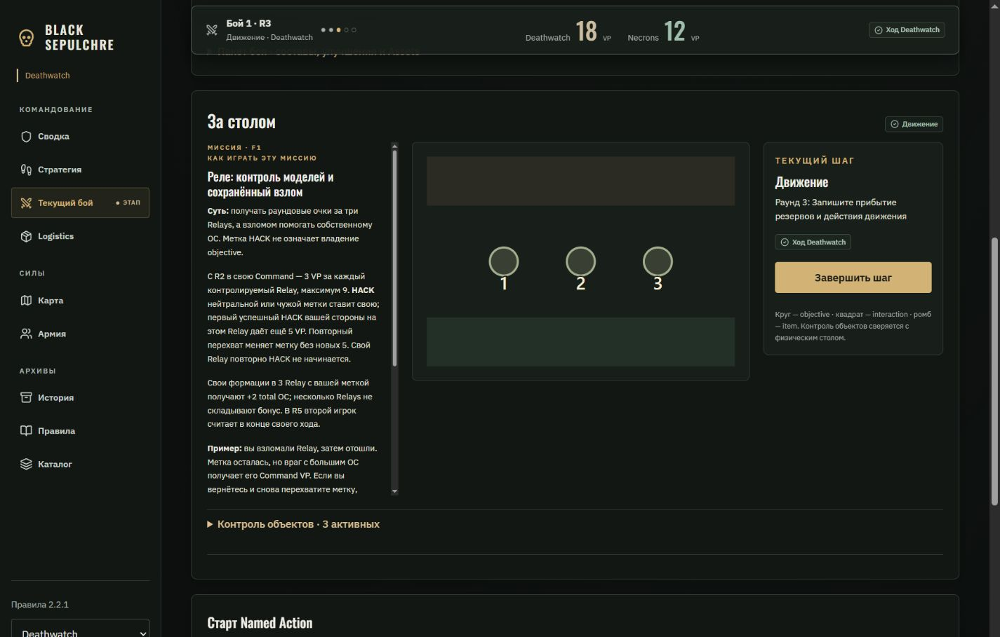
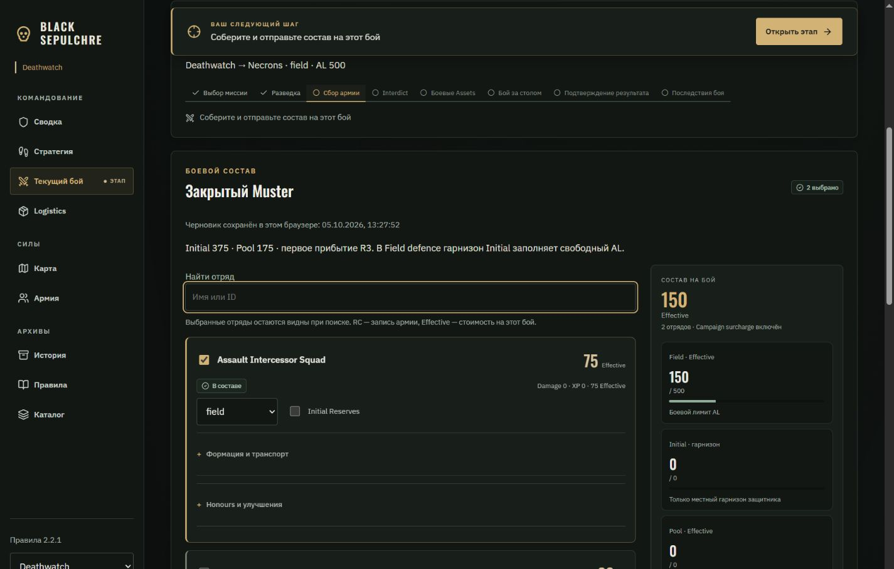
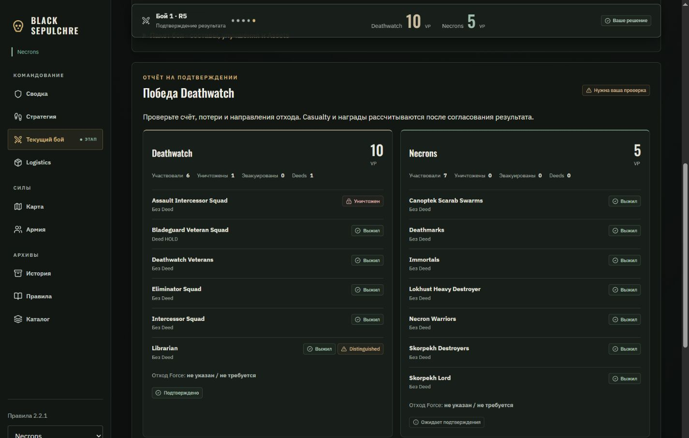
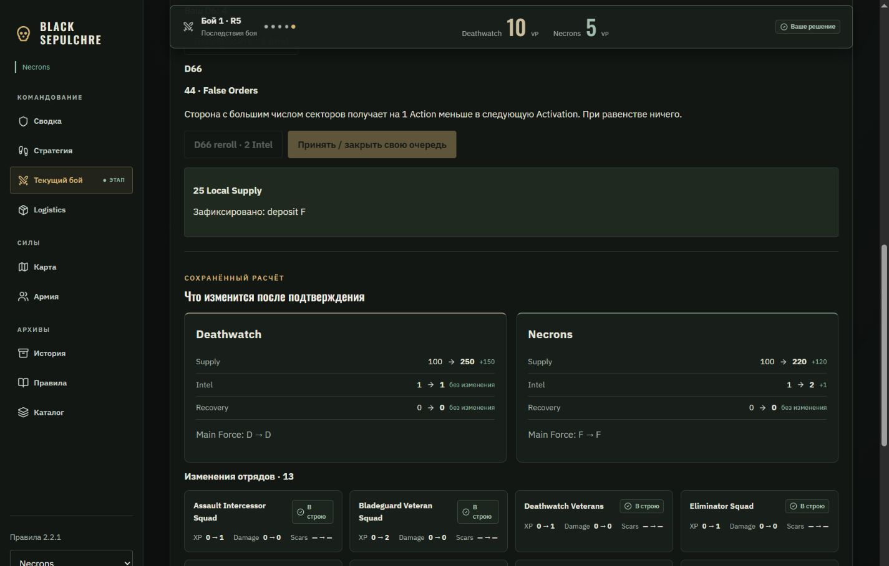
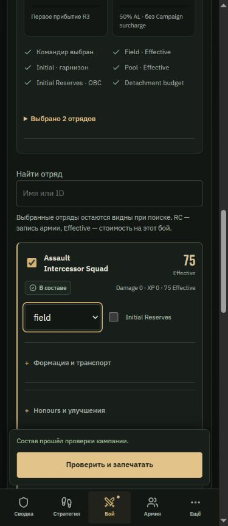

# Black Sepulchre — четвёртая фаза: Battle / Muster / Result

Дата: 05.10.2026. Продолжение [Army / Logistics](UI_UX_POLISH_PHASE_3_2026-10-05_RU.md) по предложениям обзора, прежде всего разделам 16–24 и 35.

## Внедрено

### Muster: карточки и живой бюджет

Таблица заменена карточками. На компьютере справа находится бюджет состава; на телефоне бюджеты идут перед списком, а команда отправки закреплена над нижней навигацией.

- Поиск по имени и ID. Выбранные отряды остаются видны при поиске, чтобы изменение фильтра не скрывало состав.
- Карточка показывает RC до выбора и Effective после выбора, Damage, XP, доступность и объяснение блокировки. Недоступные отряды видны в выбранной Force.
- Роль и Initial Reserves находятся на карточке. Формация / транспорт и Honours / улучшения раскрываются отдельно. Armoury, Relic, Enhancement, платные Package options, Redemption и Protocol Obsession сохранены.
- RESTING сохраняется, включая Commission, который может отдыхать, но не может войти в Field.
- Live budget: Field Effective, Initial гарнизона, Pool, Initial Reserves по OBC. У защитника Field бюджет Initial равен свободному AL; при garrison используется Initial Capacity; атакующий не получает местные Initial / Pool. STF и PACT учитывают половину AL.
- Формула цены вынесена из `validateMuster` в общий `musterCosts`. Валидатор и UI используют один расчёт: закреплённый Snapshot, цены копий, платные опции, Enhancement и Campaign surcharge. Неполный черновик показывает цену даже без командира. Если стоимость вычислить нельзя, отображается «—» с причиной.
- Бюджетные и организационные проверки показаны списком с переходами к настройкам. Полная проверка правил остаётся отдельной: один успешный бюджет не означает легальность всего состава.
- Запечатывание открывает native dialog с числом отрядов, командиром, Effective, RESTING и бюджетами. Причины отказа команды, включая порядок Recon Lock, получены из проверки на копии движка.
- Локальный черновик сохраняется по прежнему механизму до раскрытия состава. Поиск не пересчитывает дорогую проверку команд при каждом символе.

### Battle: постоянная сводка и рабочий стол

- Sticky scoreboard: номер боя, раунд, текущий шаг, действующая сторона и VP обеих фракций. На широком экране показаны пять отметок раундов; PACT дополнительно показывает Instability и Keys.
- Общий action dock на компьютере уступает верхнее закреплённое место счёту. На телефоне текущая сторона остаётся в строке шага; критические счётчики PACT сохраняются в сводке.
- Timeline различает прошлые, текущий и будущие этапы. Recon / Interdict / Assets в PACT явно обозначены как пропускаемые, в том числе до начала боя.
- На широком экране оперативная миссия, карта и текущая команда находятся рядом. На планшете и телефоне блоки перестраиваются последовательно. Длинная миссия имеет ограниченную область чтения; точная формулировка и общая памятка остаются доступны.
- Контроль объектов находится в отдельном раскрывающемся разделе. Реальные настольные условия по-прежнему подтверждает игрок.
- Маркеры различаются формой: objective — круг, interaction — квадрат, item — ромб. Есть подпись вне маркера, кольцо выбора и крест отключённого объекта.
- Объект можно выбрать мышью, Enter или Space. Выбор согласован с селектором Named Action; единственный вариант Action подставляется автоматически. Выбор нового объекта сбрасывает неподходящее старое действие.
- «Завершить шаг» заблокировано во время хода другого командира; причина показана рядом. Правила продвижения и выполнения Actions не изменены.

### Result / Report / Aftermath

- Result показывает две карточки сторон: VP, участие, уничтоженные и эвакуированные ID, Deeds, Distinguished, направления отхода и подтверждения.
- Уничтоженный отряд отличается от потерянного ID кампании: итог Casualty ещё не обещается до расчёта последствий. Не вошедшие Initial Reserves и Pool сохраняют факты отчёта.
- Подтверждение открывает сводку потерь. Второе подтверждение по прежним правилам запускает сохранение бросков и переход к последствиям.
- Report разделён на потери / Deeds, факты миссии / спасение, отход и необязательную историю. Навигация по разделам помогает работать с длинным отчётом.
- Перед отправкой выполняется `cleanReport`, затем проверка команды на копии движка. Кнопка заранее показывает причину отказа: например, второй Distinguished одной стороны или отсутствующий обязательный отход. Механизм коррекции и сохранённые броски сохранены.
- Aftermath показывает сохранённый preview: Supply / Intel / Recovery «до → после» и дельту; долг, Home Integrity и Fragments — при изменении. Отряды показывают XP, Damage, Scars, изменение Honours и Evacuation. Сравнение замечает замену Scar при том же числе Scars.
- Сводка не выполняет новый бросок. Реальное применение происходит только через существующие подтверждения обеих сторон.
- Native dialog поддерживает Escape и возврат фокуса. На время отправки повторное подтверждение отключено; ошибка отправки не закрывает сводку молча.

## Стиль

Те же матовые поверхности и тонкие фракционные линии используются в составе, результате и последствиях. Старое золото выделяет действующий этап и основные команды. Вторичные данные приглушены; рабочие числа крупнее объяснений. Новые блоки продолжают оформление Army / Logistics, без новой декоративной темы.

## Основные файлы

- `shared/muster.ts` — общий расчёт цены; прежняя полная валидация;
- `shared/battle-ui.ts` — бюджеты, объяснения доступности, проверка команды на копии движка, факты результата и сравнение preview;
- `src/views/BattleHeader.tsx`, `BattleView.tsx` — сводка и рабочий стол боя;
- `src/views/MusterView.tsx`, `MusterBudget.tsx` — состав и бюджеты;
- `src/views/ReportView.tsx`, `ResultView.tsx`, `AftermathSummary.tsx` — отчёт, проверка результата, последствия;
- `src/views/ConfirmDialog.tsx` — общий диалог проверки;
- `src/styles.css`, `src/views/common.tsx`, `src/Demo.tsx` — оформление, доступность и локальные сценарии;
- `tests/battle-ui.test.ts` — восемь дополнительных тестов.

`ReportView` продолжает экспортироваться из `BattleView` для существующих потребителей. Протокол серверных команд и экономика не менялись; общая формула стоимости была перемещена без изменения результата.

## Проверка

- **137 / 137 тестов прошли.** Дополнены проверки цены неполного состава, закреплённых цен и surcharge, различных лимитов, RESTING / Commission, приватности и порядка Recon Lock, отказа в отправке отчёта, фактов не вошедших ID, замены Scar и пропусков PACT.
- **Production build успешен.** Остаётся прежнее предупреждение большого `muster` chunk (~721 КБ).
- **Prettier:** изменённые файлы проверены.
- **Браузер:** ширины 320, 390, 820 и 1440 px; горизонтальное переполнение не обнаружено. Диалоги проверены на узком экране; основная команда Muster / Result находится над нижним меню.
- Muster: Assault Intercessors + Librarian показывают 150 / 500 Effective до выбора командира; после выбора Librarian состав запечатывается. Escape закрывает сводку и возвращает фокус. Поиск без совпадений сохраняет две выбранные карточки.
- Battle F1: R3, движение, счёт 18 : 12; счёт остаётся на верхней границе при прокрутке. Выбор Relay 2 с клавиатуры подставляет HACK; команда создаёт запись Action.
- Result: счёт 10 : 5, один уничтоженный ID Deathwatch, HOLD у Bladeguard и Distinguished у Librarian. Подтверждение Necrons переводит отчёт в Aftermath и сохраняет Casualty D6 4.
- Report: отметка второго Distinguished показывает «Один Distinguished на сторону» и блокирует отправку. Снятие отметки снова разрешает отправку.
- Aftermath: preview Supply Deathwatch 100 → 250 и Necrons 100 → 220 совпал с применением после обоих подтверждений. Показаны 13 изменений отрядов по XP. Далее открывается Logistics.
- В отдельной вкладке проверки не обнаружены console errors. Исходная пользовательская demo-вкладка сохранена.

Проверка проводилась в DEV `?demo`, без рабочей базы. Полный E2E двух Auth-сессий не запускался; специфические финальные сценарии WAR / PACT покрыты тестами движка, но не пройдены целиком в браузере. GitHub Pages не публиковался.

## Дальше

Следующий полезный этап — Overview / History: недавние последствия и события кампании, более читаемая летопись и итоговый проход согласованности всех экранов. Отдельные мобильные вкладки Live / Map / Mission / Rosters и подробный diff старой / новой коррекции можно добавить после проверки нового рабочего стола в реальной игре; в этой фазе используются последовательные responsive-блоки.

## Скриншоты

Overview / History внедрены в [пятой фазе](UI_UX_POLISH_PHASE_5_2026-10-05_RU.md).

