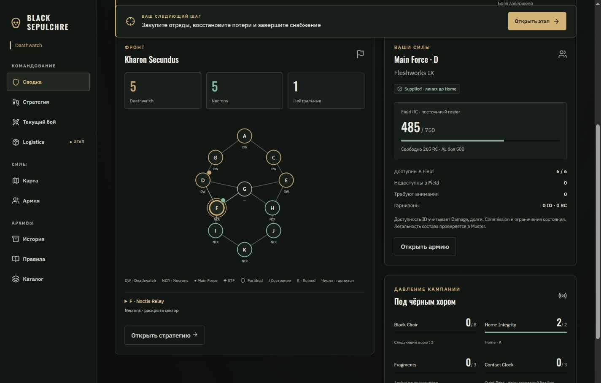
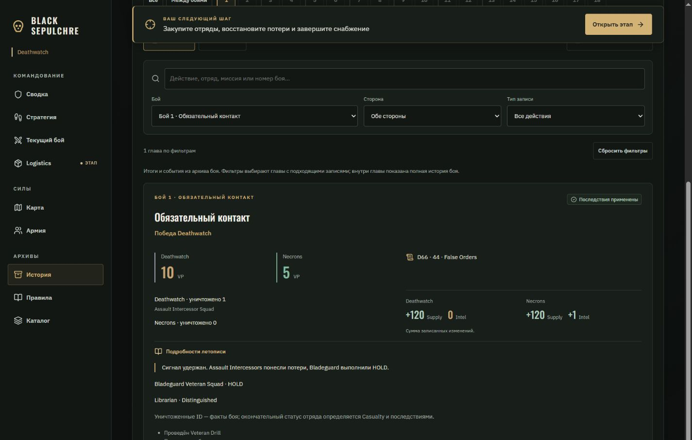
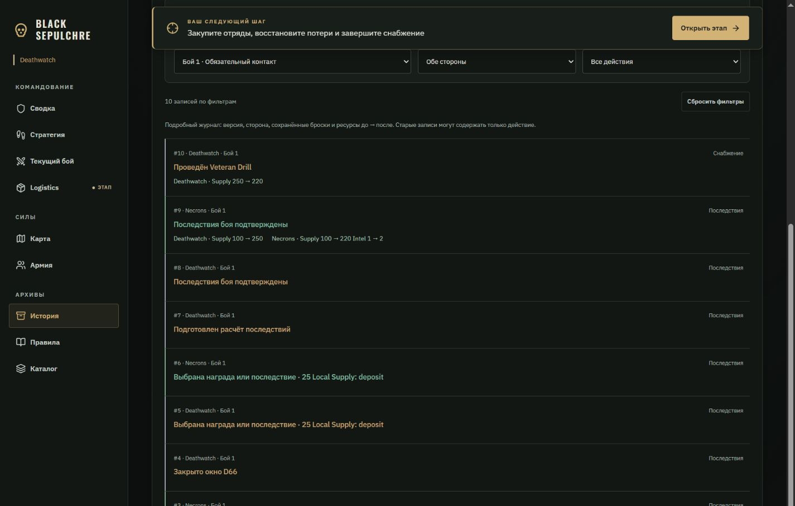
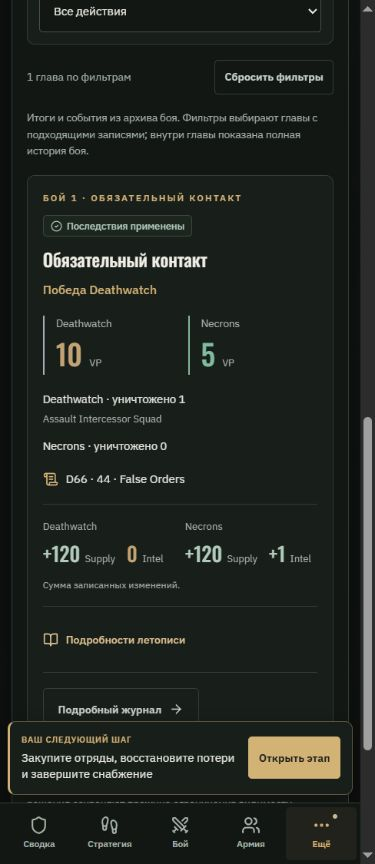
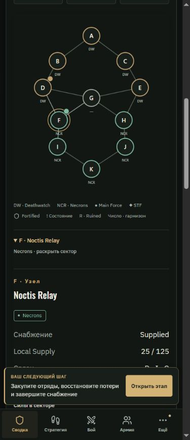

# Black Sepulchre — пятая фаза: Сводка / Летопись

Дата: 05.10.2026. Продолжение [Battle / Muster / Result](UI_UX_POLISH_PHASE_4_2026-10-05_RU.md) по предложениям разделов 13, 26, 27 и 55 исходного обзора. Предложения обзора использованы как ориентир дизайна.

## Сводка кампании

В начавшейся кампании вместо прежнего hero и полной карты используется общий `OverviewView` в приложении и DEV demo.

- Текущий этап, стратегическая активация и число завершённых боёв. Завершённые бои отделены от номера предстоящего боя в HUD.
- Фронт: количество секторов Deathwatch / Necrons / нейтральных и компактная интерактивная карта. Начальный выбранный сектор — положение своей Main Force; выбор доступен мышью и клавиатурой. Подробности выбранного сектора раскрываются по запросу.
- Свои силы: положение MF, линия снабжения, постоянный Field RC / cap, AL боя, доступные и недоступные Field ID, отряды с вопросами обслуживания, гарнизоны и STF при наличии. Это сведения о состоянии roster; полная легальность состава проверяется в Muster.
- Давление: Black Choir с ближайшим порогом, Home Integrity, Fragments / Prepared Anchor и Contact Clock / Quiet Pairs. Долг кампании показан при наличии.
- Последний бой с применёнными последствиями: исход, VP, уничтоженные ID, D66 и записанные изменения Supply / Intel. Можно сразу открыть главу этого боя.
- Последние пять решений командиров: человеческое описание, сторона, версия и номер боя. В журнале нет времени команды, поэтому время не выдумывается.
- Прямые переходы в стратегию, армию, снабжение, правила и историю. Общий Action Dock сохраняет текущую команду.

## Два режима истории

**Летопись** собирает главы из архива боёв, текущего боя и старых записей журнала. Один battle ID даёт одну главу; текущая ревизия заменяет архивную копию того же ID. Главы идут от новых к старым.

Карточка содержит миссию, состояние подтверждения, исход и VP из сохранённого отчёта, уничтоженные ID, D66, изменения ресурсов, историю игрока, Deeds / Distinguished и последние решения. Уничтоженный в бою ID не объявляется окончательно потерянным для кампании. Неподтверждённый итог помечен предварительным. Расчёт последствий отличается от уже применённых последствий.

**Журнал** сохраняет подробные записи: версия, сторона, команда, сохранённые броски, ресурсы «до → после». По умолчанию выводится 50 записей, следующие доступны кнопкой.

Общие инструменты:

- Лента боёв 1–18, границы этапов, отметки обязательного контакта / финала и текущего боя. Бои без записей недоступны; на телефоне лента прокручивается горизонтально.
- Поиск по описанию действия, названию миссии, номеру боя, стороне и доступным броскам. В летописи также ищутся история игрока и событие D66, включая архивные главы без журнала.
- Совместные фильтры боя, стороны и типа действия. В летописи они выбирают главы с подходящими записями; факты и ресурсы внутри главы остаются полными. В журнале фильтруются отдельные записи.
- Escape очищает поиск; кнопка сброса возвращает полный список. Есть отдельные состояния пустой кампании и отсутствия совпадений.
- Экспорт учитывает текущие фильтры, содержит только команды своего игрока и его изменения ресурсов. При отсутствии своих записей кнопка недоступна с объяснением.

## Достоверность данных

Новые экраны читают уже полученное состояние и используют прежнюю проекцию видимости. Серверные команды, экономика, сохранённые броски, схема базы и правила раскрытия не изменялись.

Дельта карточки — сумма **записанных изменений по журналу боя**, включая последующее снабжение и коррекции, а не только доход Aftermath. Например, в demo Deathwatch получает +150 Supply, затем тратит 30 на Drill: глава показывает +120, а журнал — оба перехода отдельно. Отсутствующие старые ресурсы обозначаются как неизвестные; частичное покрытие отмечается.

Исторические изменения XP, Scars и владения секторами не реконструируются из сегодняшнего roster: архив не хранит все необходимые снимки «после» для каждой команды. Текущие последствия подробно показывает экран Aftermath предыдущей фазы. Закрытые составы, решения и скрытые броски не становятся доступнее через поиск или экспорт.

## Проверка

- **144 / 144 тестов прошли**, включая семь новых проверок объединения глав, ревизий, дельт и обратных переходов, старых записей, совместных фильтров, собственного экспорта, доступности сил и проекции скрытых данных.
- **Production build успешен**; сохраняется прежнее предупреждение большого `muster` chunk (~721 КБ).
- Изменённые файлы проверены Prettier.
- Браузер: Сводка и История проверены на ширинах **320, 390, 820 и 1440 px**. Переполнения страницы нет; мобильная лента боёв имеет намеренную внутреннюю прокрутку.
- DEV сценарий `chronicle` проходит отправку отчёта, подтверждения, D66, выбор наград, preview и применение Aftermath настоящими командами движка; затем выполняется Drill. Проверены итог 10:5, один уничтоженный ID, False Orders, ресурсные изменения и переходы Сводка → глава боя → журнал.
- Проверены клавиатурный выбор сектора F, раскрытие инспектора, поиск Drill совместно со снабжением, чужая сторона, сброс фильтров и пустая кампания без ложных отметок текущего боя.
- JSON, скачанный через кнопку экспорта, содержит только одну выбранную запись Deathwatch: версия 10, Drill, Supply 250 → 220, без ресурсов Necrons.

Проверка выполнена локально в `?demo`, без рабочей базы. Полный E2E двух Auth-сессий не запускался. GitHub Pages не публиковался. Первая пользовательская demo-вкладка не сбрасывалась; отдельная вкладка предпросмотра сохранена.

## Основные файлы

`shared/chronicle.ts`, `src/views/OverviewView.tsx`, `HistoryView.tsx`, `ChronicleCard.tsx`, `CampaignMap.tsx`, `src/App.tsx`, `src/Demo.tsx`, `src/styles.css`, `tests/chronicle.test.ts`.

Следующий этап — контекстные пояснения правил и навигация по ним из рабочих экранов. Durable-снимки для подробной исторической эволюции отрядов и секторов потребуют отдельного расширения данных.

Контекстные правила реализованы в [фазе 6](UI_UX_POLISH_PHASE_6_2026-10-05_RU.md).

## Скриншоты

