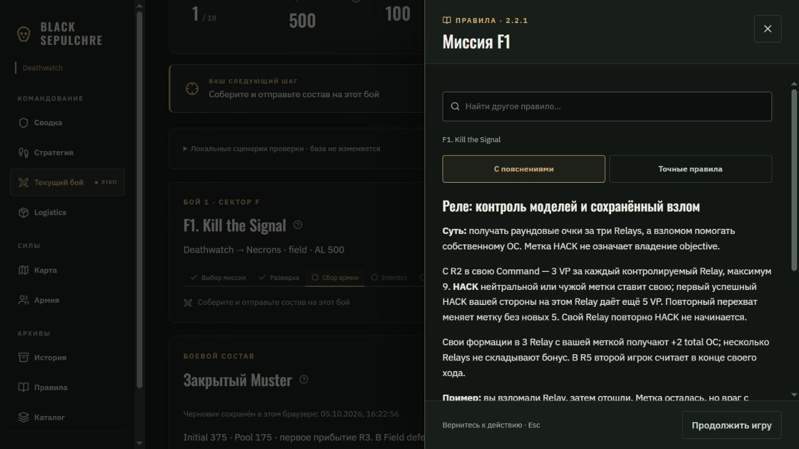
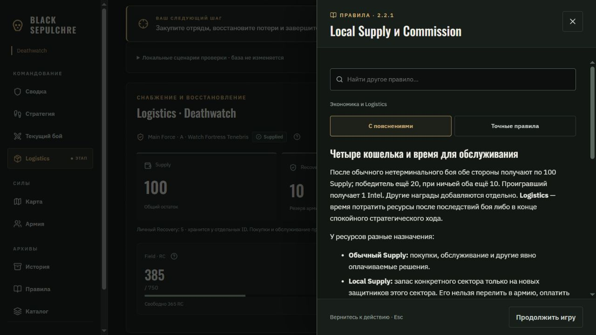
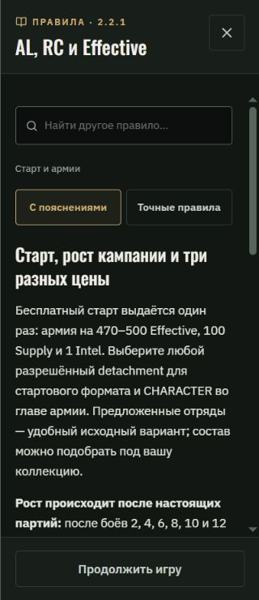

# UI/UX polish · фаза 6 · контекстные правила

Дата: 05.10.2026. Продолжение [фазы 5](UI_UX_POLISH_PHASE_5_2026-10-05_RU.md).

Из предложений обзора реализованы прежде всего §§28–29: справка рядом с рабочим действием и пояснения терминов. Документ использован как источник предложений по дизайну; игровые условия берутся из действующего авторского свода 2.2.1 и его пояснений.

## Что доступно игроку

Кнопки со знаком вопроса открывают одну боковую панель. Текущий экран остаётся на месте, выбранные отряды и поля формы сохраняются. На телефоне панель занимает экран, имеет отдельную прокрутку текста и постоянно видимую кнопку возврата.

Подключены наиболее полезные точки входа:

- HUD: AL, Recovery, Choir и аварийный долг.
- Карта и стратегия: Supplied, Local Supply и Strategic Action.
- Армия: RC / Field cap, Recovery / Damage, Battle Honours, Scars своей фракции и Local Commission.
- Logistics: линия снабжения, местный запас и восстановление. Справка отряда находится вне отключённого fieldset обслуживания и доступна даже при отсутствии Force в его секторе.
- Подготовка боя: Muster, Recon Lock, Assets, Field / Initial / Pool / Reserves, Detachment Points и Emergency Muster.
- Текущий бой: карточка выбранной миссии и переход к общим правилам Actions / scoring.
- Сводка: Home Integrity, Choir и Fragments.

Панель поддерживает пояснения, точные формулировки, поиск других правил и состояние отсутствия совпадений. После выбора результата поиска обновляются заголовок панели и фокус на заголовке текста. Есть явная ссылка на общую памятку из обычной миссии.

Escape в заполненном поиске очищает запрос. Следующий Escape закрывает панель. Закрытие кнопкой или нажатием снаружи возвращает фокус к исходной кнопке. Tab / Shift+Tab циклически обходят доступные элементы внутри диалога; фон недоступен благодаря `showModal()`.

## Единый источник и спойлеры

Полный справочник и контекстная панель используют общий каталог. Из сгенерированных файлов сохранены точные тексты, пояснения и вступление сектора перед карточкой миссии. Общие карточки осад A/K разрешаются по обоим кодам без повторного текста и без потери пояснений. Generated-файлы вручную не редактировались.

Кризисные разделы скрыты из поиска до явного включения спойлеров. Нажатие на Choir открывает предупреждение, а не всю историю. Разрешение не запоминается между открытиями. Текущий финал WAR или PACT может открыть собственное правило без раскрытия остальных финальных разделов.

Для Emergency Muster выделен **только существующий механический абзац** из подготовки к финалу и соответствующий абзац авторского пояснения. Эта помощь нужна перед обязательным боем; окружающий сюжет финала в обычную справку не попадает. Числа и ограничения не переписаны.

Каталог правил и компонент чтения загружаются через динамический импорт при открытии справки. Ошибка загрузки предлагает PDF правил. Панель закрывается при смене раздела, кампании или стороны.

## Визуальная полировка

Сохранены матовые тёмные поверхности, старое золото, IBM Plex Sans для текста и Oswald для заголовков. Подсказки не добавлены к каждому слову: выбраны места, где термин влияет на решение игрока.

На узких экранах кнопки помощи имеют область нажатия 44×44 px. В плотном HUD кликабельна вся соответствующая карточка, а маленький знак вопроса расположен у значения: подписи ресурсов не вытесняются. Таблицы точных правил прокручиваются внутри своего контейнера.

## Проверка

- **150 / 150 тестов прошли.** Шесть новых проверок покрывают связь с авторским источником, Emergency Muster без окружающего сюжета, все коды миссий и A/K aliases, скрытие кризиса, разрешение только текущего финала и поиск с фильтрами.
- **Production build успешен.** Сохраняется прежнее предупреждение крупного `muster` chunk (~721 КБ); справочник находится в отдельном chunk (~168 КБ, ~50 КБ gzip).
- TypeScript и Prettier прошли для изменённых файлов.
- Браузер проверен на ширинах **320, 390, 820 и 1440 px**. Переполнения страницы и текста панели нет. Таблица AL имеет собственную горизонтальную прокрутку. На 320 px устранено обнаруженное теснение подписей HUD новыми кнопками.
- Проверены режимы чтения, поиск, отсутствие результатов, переход к общим Actions / scoring, Escape, возврат фокуса, обход Tab / Shift+Tab и закрытие.
- Muster: выбран Librarian и назначен командир; после чтения Pool сохранены один отряд, тот же командир и **75 Effective**.
- Logistics: правила Local Commission открываются для Deathwatch Veterans, даже когда обслуживание в секторе B отключено из-за Main Force в A.
- Проверены явное раскрытие Choir и повторное открытие с выключенными спойлерами. Ошибок в консоли браузера нет.

Проверка выполнена локально в DEV demo. Рабочая кампания и база не изменялись; двухсессионный браузерный E2E не запускался. Изменения ещё не опубликованы на GitHub Pages. Отдельная вкладка предпросмотра сохранена.

## Основные файлы

`src/content/rule-topics.ts`, `src/content/rule-library.ts`, `src/views/RulesContext.tsx`, `src/views/RulesDrawer.tsx`, `ReferenceView.tsx` и контекстные ссылки в рабочих экранах, `src/styles.css`, `tests/rule-library.test.ts`.

Следующий полезный этап — довести оставшиеся вспомогательные экраны до общего визуального языка и выполнить финальный проход по адаптивности и доступности всей кампании. Durable-снимки истории отрядов остаются отдельной задачей данных, описанной в фазе 5.

## Скриншоты

