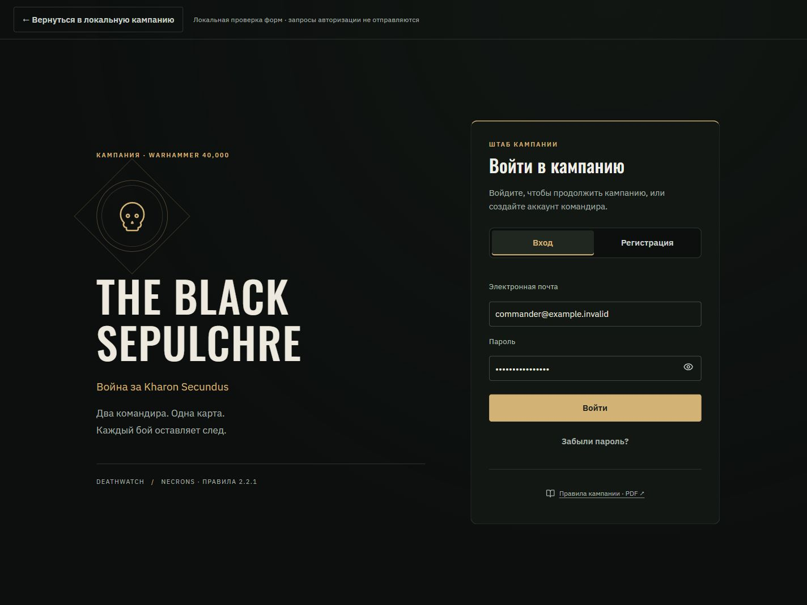
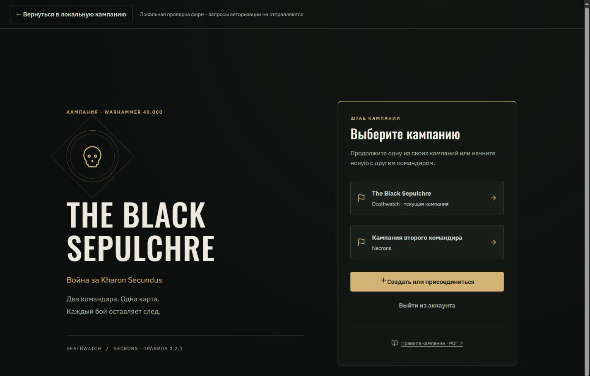
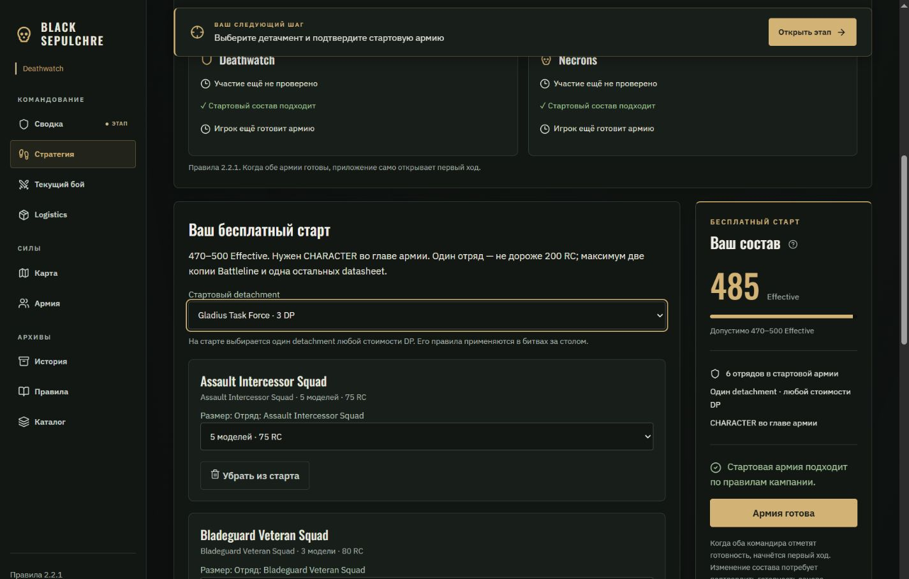
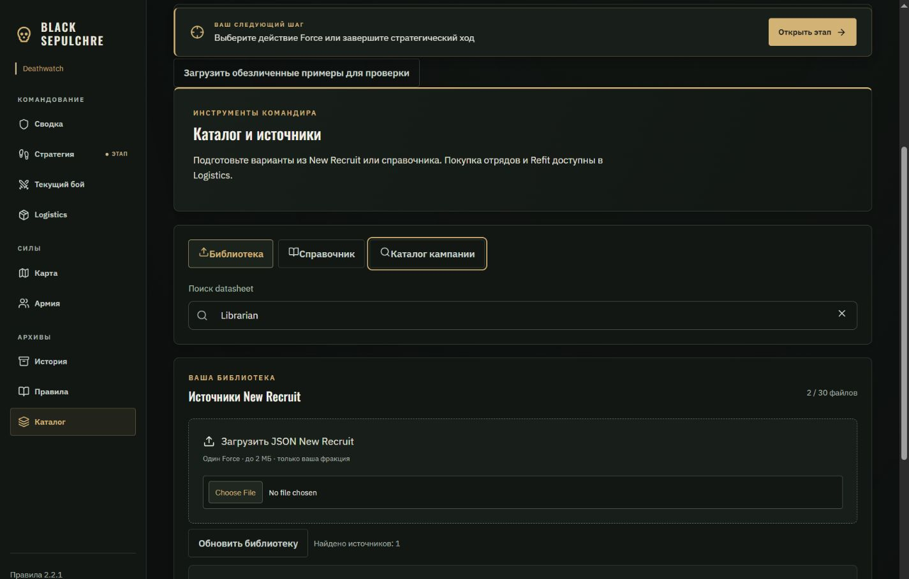
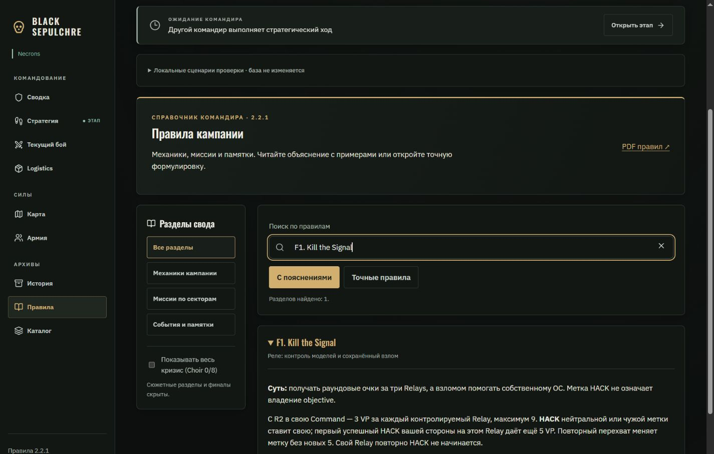
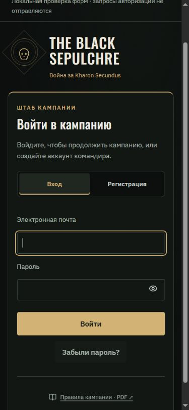
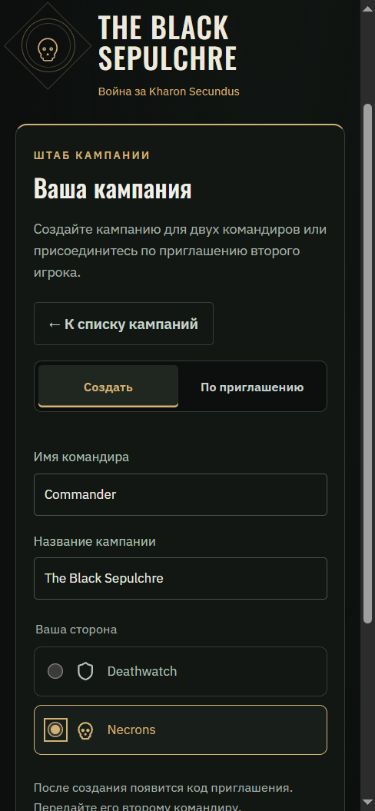
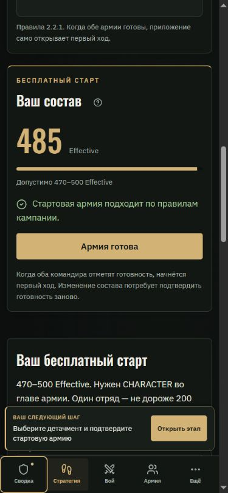
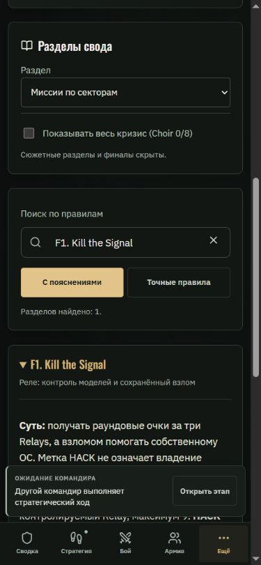

# Black Sepulchre — фаза 7: вход, подготовка и справочники

Дата: 05.10.2026. Продолжение [фазы 6](UI_UX_POLISH_PHASE_6_2026-10-05_RU.md). Основа — предложения исходного обзора о входе, едином стиле, компактных инструментах, загрузке и доступности (§31, 45, 46, 51, 59). Это рекомендации для дизайна; игровые правила и разрешения на публикацию определяются отдельно.

## Что изменилось

### Вход и кампании

- Общий экран `AccessLayout`: крупное название, спокойный знак, матовые поверхности и старое золото. На телефоне бренд становится компактным блоком над формой.
- Вход / регистрация переключаются кнопками с явным выбранным состоянием. Пароль можно показать; смена режима очищает его. У электронной почты и пароля появились подсказки ошибок, сохранены браузерные autocomplete и проверка полей.
- Восстановление доступа и установка нового пароля используют ту же оболочку. Сохранён запасной способ открыть ссылку из письма.
- Выбор кампании показывает название, сторону и текущую кампанию. Создание и подключение по приглашению разделены; фракция выбирается карточками с обычными radio inputs. Пустой код, имя из пробелов и пустое название не отправляются.
- `AuthForm` и `CampaignAccess` отделяют представление от запросов. Production использует прежние вызовы Supabase Auth и RPC; DEV demo подставляет локальные обработчики для проверки без настоящих аккаунтов.

### Стартовая армия

- Состав отображается карточками отрядов, добавление — отдельным блоком.
- Рядом находится сводка Effective, допустимого диапазона 470–500, числа отрядов, причины ошибки и подтверждения готовности. На телефоне сводка расположена перед редактором состава.
- Карточки двух командиров показывают участие, соответствие состава и подтверждение готовности. Неизвестное участие остаётся неизвестным.
- Проверка состава по-прежнему выполняется `startingArmy`; карточка бюджета не заменяет ограничения CHARACTER, копий, отдельных отрядов и detachment. Команды подготовки и переход к первому ходу сохранены.

### Каталог

- Три раздела: библиотека New Recruit, справочные datasheets и готовые варианты кампании. Общий поиск фильтрует каждый раздел, игнорирует пробелы по краям; Escape очищает запрос.
- У библиотеки появились загрузочная структура, понятное пустое состояние и отсутствие совпадений. Данные SHA-256 убраны в дополнительное раскрытие источника.
- Редактор выбранного варианта открывается в начале рабочей области. Фокус переходит к нему; закрытие возвращает фокус к источнику или поиску, если исходный раздел скрыт. Переключение разделов сохраняет черновик.
- Загрузка Wahapedia остаётся явной; повторные нажатия блокируются на время запроса. Ошибку можно исправить повторной загрузкой.
- Каталог привязан к кампании и стороне через React key; при смене контекста прежняя библиотека, поиск и редактор не показываются в новом контексте. Ограничения публикации, цены, загрузка и сохранение вариантов остаются прежними.

### Полный свод правил и загрузка

- Разделы вынесены в боковую навигацию; на телефоне используется select. Поиск и режим чтения видны до длинных пояснений первой игры.
- Найденные главы отображаются компактными раскрывающимися карточками. Единственный результат раскрывается автоматически; несколько результатов позволяют выбрать нужный.
- Есть сброс пустого поиска и очистка Escape. Выключение спойлеров убирает кризис и возвращает общий раздел, если он был выбран.
- Сохранены авторские формулировки, пояснения и PDF. Таблицы прокручиваются внутри своего блока.
- Общий `ScreenLoading` заменяет голый текст при проверке доступа, загрузке кампаний, кампании и ленивых разделов. Он имеет статус для screen reader и статические декоративные блоки без анимации.

## Проверки

- **150 / 150 тестов прошли**, включая правила стартового состава, кампании двух сторон, ограничения каталога, импорт, изоляцию источников, восстановление по ссылке и поиск правил.
- **Production build успешен**, TypeScript и Prettier прошли. Сохраняется прежнее предупреждение `muster` chunk (~721 КБ); новый этап не меняет его содержимое.
- Браузерная проверка выполнена на **320, 390, 820 и 1440 px**. У проверенных экранов нет горизонтального переполнения страницы. На 320 px таблицы справочника используют собственную прокрутку.
- Вход: неверная почта, видимость пароля, смена режима, подсказка длины, локальная отправка регистрации / восстановления и блокировка полей во время запроса. Реальные запросы Auth не отправлялись; экран установки нового пароля проверен сборкой и общим компонентом поля, без смены настоящего пароля.
- Кампании: выбор, создание, фракции, приглашение, блокировка кода из пробелов и имени из пробелов. Проверены локальные обработчики, без создания кампании в базе.
- Подготовка: 485 Effective у Deathwatch и 475 у Necrons; удаление Librarian блокирует готовность с причиной; подтверждение двух армий открывает стратегический ход.
- Каталог: пустая библиотека, два обезличенных примера Deathwatch, поиск / отсутствие совпадений, справочник, таблицы, редактор на 320 px, сохранение черновика при смене раздела и возврат фокуса. Смена стороны очищает контекст библиотеки. Реальный файловый диалог и серверное сохранение источника в браузере не запускались; их обработчики сохранены, импорт и RPC покрыты существующими тестами.
- Свод: поиск F1, режимы чтения, пустой запрос и сброс, категории, раскрытие / повторное скрытие кризиса, точная таблица стартовых цен, Escape.
- Ошибок и предупреждений в консоли отдельной вкладки проверки нет.

Проверка выполнялась локально в DEV demo. Рабочая кампания и база не изменялись. Изменения ещё не опубликованы на GitHub Pages. Отдельный предпросмотр сохранён.

## Следующий этап

Остаётся общий проход по всем экранам: согласованность состояний отправки и подтверждений, доступность с клавиатуры, язык интерфейса, редкие переходы и адаптивность. Перед публикацией — проверка двух игроков в изолированной среде, сетевых ошибок / повторной отправки, коррекции результата и WAR / PACT. Снимки истории отрядов и дополнительные инструменты вроде Ctrl+K остаются отдельными задачами, описанными в предыдущих фазах.

## Скриншоты

Экран входа с тестовыми данными локальной формы:

