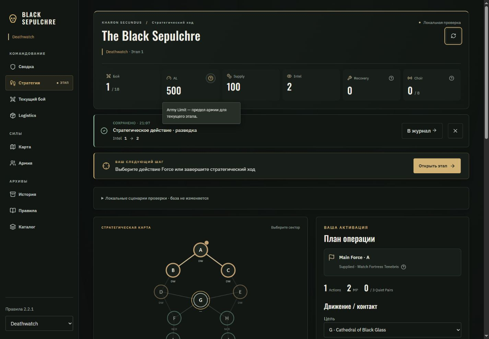
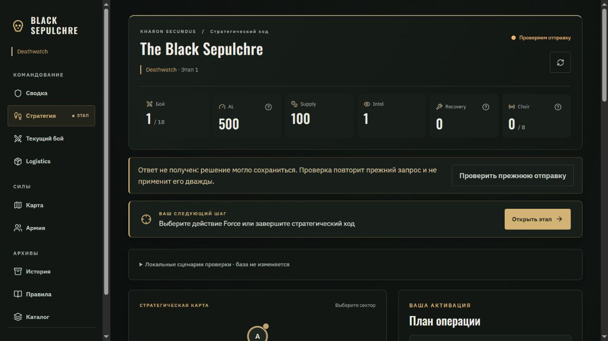
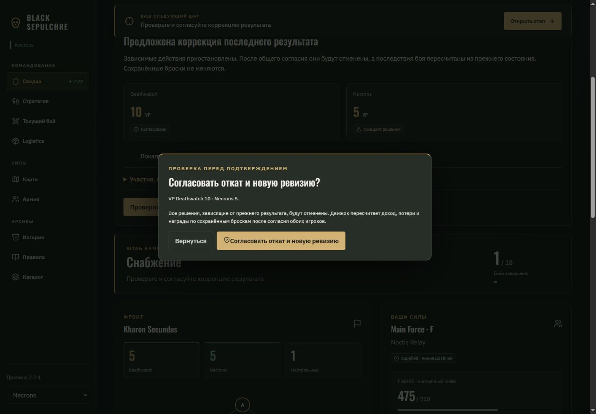
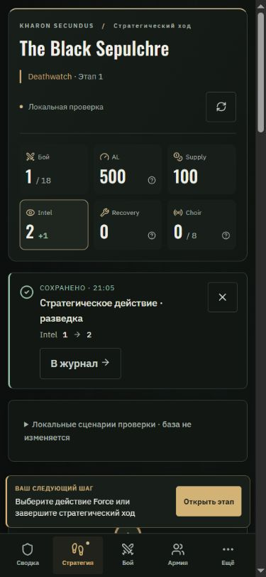
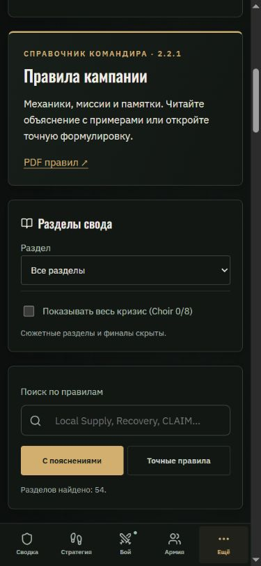
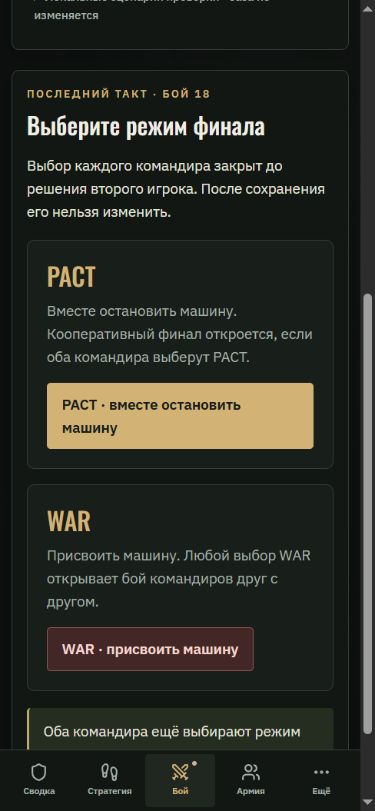

# Black Sepulchre — фаза 8: подтверждения, доступность и редкие переходы

Дата: 05.10.2026. Продолжение [фазы 7](UI_UX_POLISH_PHASE_7_2026-10-05_RU.md). Основа — рекомендации исходного обзора об обратной связи, доступности и адаптивной полировке после стабилизации layout (§64–65). Рекомендации документа используются как материал для дизайна; публикация и изменение рабочей базы требуют отдельного решения.

## Что изменилось

### Подтверждённое сохранение

- После успешной команды появляется спокойное подтверждение: какое решение сохранено, время и фактические изменения собственных Supply / Intel. Есть переход в журнал и закрытие сообщения. Оно остаётся до следующего решения, смены контекста или закрытия.
- Подтверждение строится из ответа на команду и записи журнала нужной версии. Локальный прогноз, ошибка, отсутствие ответа и состояние другой кампании не показываются как успешное сохранение. Закрытый payload и ресурсы соперника не попадают в сообщение.
- Повтор неопределённой отправки сохраняет прежние UUID и исходную версию. Проверка соединения перед повтором не удаляет запрос. Ответ из прежней кампании после переключения контекста не очищает новый запрос и не показывает старое подтверждение.
- В DEV доступны имитации медленной отправки, отсутствия интернета, конфликта версии, потерянного ответа и резервной синхронизации. При потере ответа локальный движок сохраняет решение один раз, интерфейс оставляет последнее известное состояние, а проверка прежнего запроса возвращает сохранённое подтверждение. Это инструмент проверки без серверных запросов; production-сборка его исключает.

### Клавиатура и мобильное чтение

- Навигация, ссылка «К содержимому», переход к журналу и кнопка следующего шага переводят фокус в нужную рабочую область. Ленивый экран может появиться позже: перенос фокуса дожидается его. Учитывается предпочтение уменьшенного движения.
- Окна подтверждения, контекстных правил и мобильной навигации используют общий цикл Tab / Shift+Tab. Нативное поведение Escape и возврат к исходной кнопке сохраняются.
- Окна подтверждения размещены через portal вне заблокированного рабочего fieldset. После неопределённой отправки можно вернуться к экрану и проверить прежний запрос; блокировка команд больше не блокирует выход из окна. Повторное подтверждение во время отправки защищено отдельным флагом.
- Смена экрана входа / регистрации / восстановления переводит фокус к новому заголовку.
- На телефоне следующий шаг находится в потоке страницы в справочниках, истории, сводке, на карте, при ожидании и при выборе режима финала. Он больше не перекрывает читаемый текст. Для рабочих экранов сохранена закреплённая панель; при редактировании поля она освобождает место. Отступ прокрутки учитывает нижнюю навигацию и рабочую панель.

### WAR / PACT и ревизия результата

- Выбор финала показывает отдельные карточки PACT и WAR, условия открытия режима и предупреждение о невозможности изменить сохранённый выбор. Перед отправкой открывается подтверждение конкретных последствий. Соперник до второго решения видит только факт готовности.
- Предложение ревизии стало общим компонентом для приложения и DEV-проверки: счёт, согласие сторон, история, раскрываемые факты участия и отдельное подтверждение отката зависимых решений.
- Исправлена обнаруженная блокировка редактора ревизии: публичная проекция намеренно не содержит внутреннюю базу отката, поэтому симуляция серверной команды на ней ошибочно возвращала «Нет сохранённого результата». Клиент теперь проверяет доступность и видимую структуру отчёта; сервер сохраняет полную проверку по исходному приватному состоянию. В интерфейсе это различие описано явно.
- Локальные сценарии финального выбора и подготовки WAR / PACT проходят через существующие команды движка. Игровые правила, серверная валидация, RLS, миграции и Auth-настройки не изменены.

## Проверки

- **155 / 155 тестов прошли.** Добавлены четыре проверки подтверждений: реальный Recon, отсутствие / неверная версия ответа, отсутствие ресурсов соперника и закрытого payload, повтор сохранённого ответа без мутации состояния. Добавлена регрессия ревизии на публичной проекции с сопоставлением допустимого и недопустимого отчёта с настоящим движком.
- **Production build успешен.** Сохраняется прежнее предупреждение о размере muster chunk: 720.99 kB. Уникальные строки DEV-транспорта отсутствуют в production JavaScript.
- В браузере проверены обычная, медленная и неопределённая отправка, повтор прежнего UUID, отсутствие интернета и конфликт версии. Ошибки не создают подтверждение успеха; медленная отправка блокирует повторную команду.
- Проверены Tab / Shift+Tab, Escape, возврат фокуса, выход из окна при неопределённой отправке, переход к содержимому / журналу / этапу и заголовок восстановления доступа.
- Ревизия проверена от редактирования истории до предложения, согласия второй стороны и возврата к подтверждению результата. Проверены закрытый первый выбор PACT, последующий WAR и предусмотренные пропуски подготовки PACT. Более полный ход кампании, сохранение бросков при ревизии и terminal gates остаются покрыты существующими тестами движка.
- Проверены ширины **320, 390, 820 и 1440 px**. На 320 px окно подтверждения WAR помещается в экран; горизонтального переполнения страницы в проверенных режимах нет. На 390 px подтверждение решения находится выше нижней рабочей панели, а справочник читается без её перекрытия.
- В консоли отдельной вкладки предпросмотра нет ошибок и предупреждений. `git diff --check` проходит.

Браузерная проверка выполнялась в локальном DEV с обезличенными данными. Это проверка интерфейса и движка, а не двух независимых Auth-сессий. Ручная проверка screen reader и реальной экранной клавиатуры телефона не проводилась.

## Состояние после фазы 8, до публикации

1. Запустить изолированный браузерный тест двух настоящих Auth-аккаунтов. Селекторы существующего теста обновлены под новые формы входа и создания / подключения кампании. Локальный запуск ограничен окружением: установленный Docker Desktop запускается как приложение, но `docker desktop status` показывает `stopped`, а запрос версии Linux Engine возвращает HTTP 500. Supabase-стенд не поднят; локальный E2E не считается пройденным. Для выпуска используется существующий workflow **Two-player browser integration** в GitHub Actions: он поднимает отдельный Supabase на Ubuntu и выполняет тот же тест.
2. После успешного теста проверить публикацию GitHub Pages и рабочие Auth / Realtime / reconnect сценарии. Изменения этой фазы ещё не опубликованы; рабочая кампания и база не изменялись.

Основные визуальные экраны из обзора уже получили общий стиль. Дополнительные инструменты вроде Ctrl+K и отдельные подробные истории ветеранов остаются самостоятельными улучшениями после проверки выпуска.

## Скриншоты

